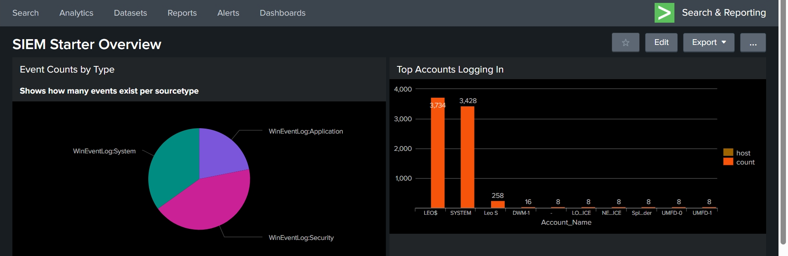

# Splunk SIEM Lab – Windows Event Log Monitoring

## Overview
This project demonstrates hands-on experience with Splunk Enterprise for Security Information and Event Management (SIEM).  
The goal was to ingest Windows Event Logs, create security-focused dashboards, configure alerts, and practice SOC analyst workflows.

## Data Sources
- **Windows Event Logs** from a forwarder:
  - Security
  - System
  - Application

## Key Features
- **Dashboards**  
  - Authentication activity (Event ID 4624 – logon, 4625 – failed logon)  
  - Privilege escalation (4672, 4717)  
  - Credential use (4648, 4798, 4799)  
  - Kerberos / cryptographic events (5058, 5059, 5061, 5379, 5382)  
  - System changes (4616 – time change, 4732 – group membership)  
- **Alerts**  
  - Real-time and scheduled alerts for suspicious activity (e.g., failed logon spikes, time changes, privilege use).  
- **Drilldowns**  
  - Click-through on panels to pivot into raw event data for deeper investigation.  
- **Visualizations**  
  - Bar charts, line graphs, pie charts with custom colors.  

## Screenshots
## 📸 Screenshots & Demo

Below are selected screenshots from my Splunk SIEM lab project.  
They demonstrate both the configuration steps I performed and the dashboards I created.

### Data Onboarding
- Configured `inputs.conf` and `outputs.conf` for the Splunk Universal Forwarder.  
- Successfully ingested Windows Event Logs (Security, Application, System).  

### Search Queries (SPL)
- Example query to detect failed logon attempts (EventCode 4625).  

### Dashboards
- Event Counts (all Windows logs).  

- Failed Logons by User.  
  

- Privileged Logons (EventCode 4672).  
  

### Alerts
- Configured real-time alert for failed logons (EventCode 4625).  

## Learning Outcomes
- Built a SIEM workflow from scratch.  
- Practiced detection and alerting on Windows security events.  
- Developed dashboards useful for SOC analyst monitoring.  
- Gained hands-on experience with Splunk search (SPL), alerting, and dashboard customization.  

---

### Author
Olusegun Soares – Cybersecurity Enthusiast  
[LinkedIn Profile](#) | [GitHub Profile](#)
