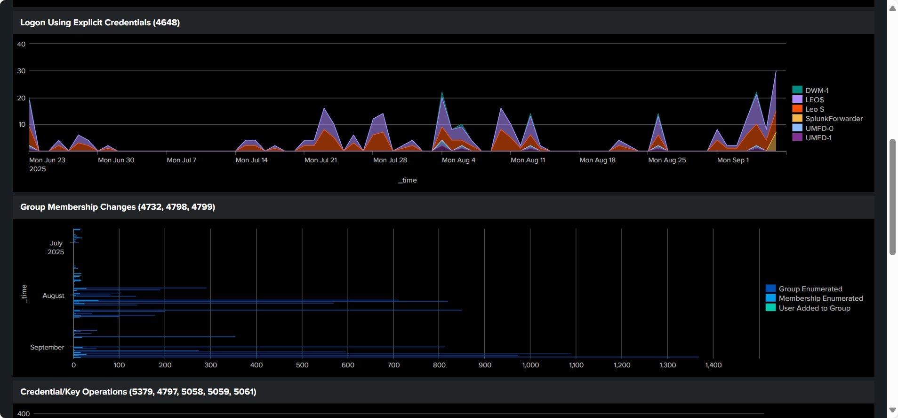
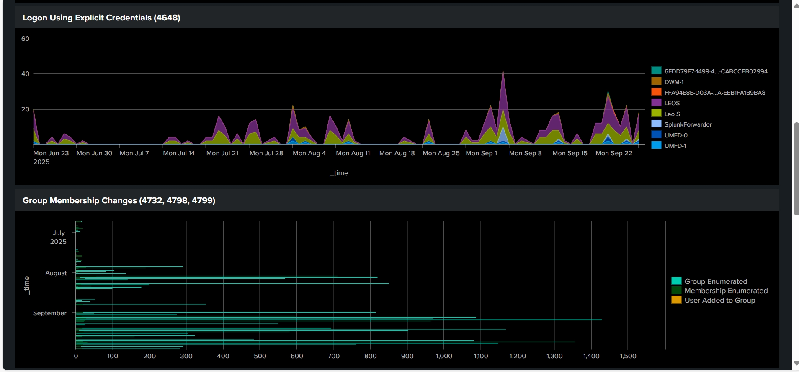

# Splunk SIEM Lab – Windows Event Log Monitoring

## Overview
This project demonstrates hands-on experience with Splunk Enterprise for Security Information and Event Management (SIEM). The goal was to implent Windows Event Logs, create security-focused dashboards, configure alerts, and implement SOC analyst workflows to enhance the security operations of the organization.

## Data Sources
- **Windows Event Logs** from a forwarder:
  - Security
  - System
  - Application

## Key Features
- **Dashboards**  
  - Authentication activity (Event ID 4624 – logon, 4625 – failed logon)  
  - Privilege escalation (4672, 4717)  
  - Credential use (4648, 4798, 4799)  
  - Kerberos / cryptographic events (5058, 5059, 5061, 5379, 5382)  
  - Explicit credentials & Group membership (4648, 4732)
  
- **Alerts**  
  - Real-time and scheduled alerts for suspicious activity (e.g., failed logon spikes, time changes, privilege use).
 
- **Drilldowns**  
  - Click-through on panels to pivot into raw event data for deeper investigation.
  
- **Visualizations**  
  - Bar charts, line graphs, pie charts with custom colors.  

### Search Queries (SPL)
- Example query to detect failed logon attempts (EventCode 4625).  

### Dashboards

- Event Counts (all Windows logs)  

- Failed Logons by User (Event Code 4672): Shows the number of unsuccessful login attempts, helping identify possible brute-force or unauthorized access attempts.

- Privileged Logons (Event Code 4672): Tracks logins where special administrative privileges were assigned, highlighting high-risk activity.

- System Security & Credential Operations (Event Code 4616, 4717, 5379, 4797, 5058, 5059,5061): Captures events related to account security changes, credential use, and sensitive operations on the system.

- Explicit credentials & Group Membership (Event Code 4648, 4732, 4798, 4799): Records when accounts use explicit credentials or are added to groups, which may indicate privilege escalation

### Alerts
- Configured real-time alert for logons and security operations.  

## Learning Outcomes
- Designed and implemented a complete SIEM workflow.  
- Developed dashboards for SOC analyst monitoring.
- Configured detection rules and alerts for Windows security events.
- Applied log analysis techniques to identify anomalies and potential threats.
- Correlated event sources to improve incident detection accuracy.
- Documented detection use cases and operational procedures for SOC reference.
- Proven hands-on experience with Splunk search (SPL), alerting, and dashboard customization.  

---

### Author
Olusegun Soares – Cybersecurity Enthusiast  
[LinkedIn Profile](https://www.linkedin.com/in/olusegun-soares-59862582/) | [GitHub Profile](https://github.com/olusegunsoares)
